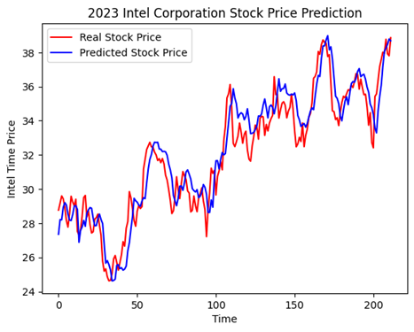
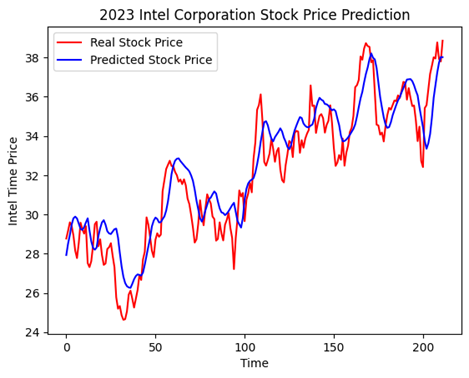
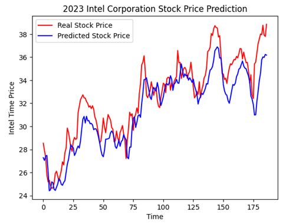
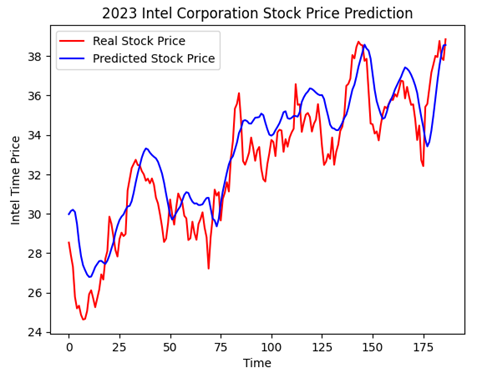
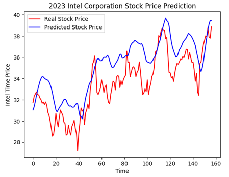
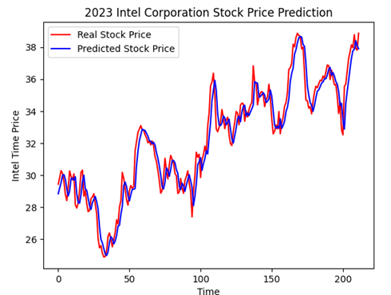
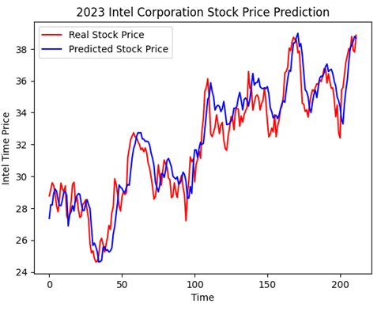

# Conclusion

## Experimental Results and Model Comparison (RNN vs. LSTM)

In the initial experiment, both RNN and LSTM models were trained and evaluated using the same dataset and identical parameter settings. The results are shown below.

**Figure 1.** RNN model with a 5-day look-back window, achieving an MSE of 1.50.

**Figure 2.** LSTM model with a 5-day look-back window, achieving an MSE of 1.75.

From Figures 1 and 2, it is evident that the RNN model achieved higher prediction accuracy than the LSTM model under short look-back conditions. However, based on prior studies and theoretical foundations, LSTM’s long short-term memory mechanism is generally expected to better capture temporal dependencies in stock price prediction. Therefore, further experiments were conducted by adjusting the look-back window length.

---

**Figure 3.** RNN model with a 30-day look-back window, achieving an MSE of 2.80.

**Figure 4.** LSTM model with a 30-day look-back window, achieving an MSE of 2.60.

After increasing the look-back window to 30 days, overall model performance degraded, and MSE values increased beyond expected ranges. Although LSTM did not show significant improvement, it demonstrated slightly better stability and marginally higher accuracy than RNN. Based on this observation, the look-back window was further increased for additional testing.

---

**Figure 5.** RNN model with a 60-day look-back window, achieving an MSE of 2.50.

**Figure 6.** LSTM model with a 60-day look-back window, achieving an MSE of 4.80.

As shown above, when the look-back window was increased to 60 days, the LSTM model exhibited clear overfitting behavior. This demonstrates that larger parameter values do not necessarily lead to better performance, and excessive historical information may introduce noise rather than useful signals.

From the progressive experiments, we conclude that RNN performs particularly well in short-term stock price prediction, offering faster computation and better suitability for next-day forecasting. Although LSTM is theoretically advantageous for capturing long-term dependencies, it failed to deliver reliable predictions under the tested conditions.

Stock prices are highly sensitive to external factors such as political events, earnings announcements, and market uncertainty. Furthermore, our dataset indicates that factors such as gold prices and crude oil prices do not have a consistently strong influence on the selected stock, meaning that longer historical windows may reduce predictive effectiveness.

Overall, experimental results and prior literature suggest that RNN is more effective for short-term stock prediction, while LSTM may be more appropriate for long-term trend analysis. However, due to the complexity and volatility of financial markets, deep learning models must be applied cautiously, and excessive look-back periods may degrade predictive accuracy.

---

## Advantages of Single-Feature Input vs. Multi-Feature Input

Through comparative testing, we found that the number of input features does not necessarily correlate positively with prediction accuracy. Model performance depends heavily on dataset characteristics and the chosen architecture.

**Figure 7.** Model performance using only the closing price as input.

**Figure 8.** Model performance using multiple input features.

While additional features may provide more information, an excessive number of features increases the risk of overfitting. As feature dimensionality grows, the sample space becomes sparser, requiring significantly more data to maintain generalization performance. When the dataset has high dimensionality but limited samples, the model may fit the training data well but perform poorly on unseen data.

Therefore, the impact of feature quantity depends on the dataset and task objectives. Feature selection or dimensionality reduction is recommended prior to model training to ensure that only informative and relevant features are retained. In short-term stock prediction tasks, using only the closing price often yields the highest predictive accuracy.

---

## Future Work

Although the current models are capable of predicting next-day stock price movements, there is still considerable room for improvement in terms of practicality and predictive depth. Future efforts will focus on extending prediction horizons and improving long-term forecasting performance to enhance investment efficiency and potential returns.

We plan to strengthen model architectures by exploring alternative deep learning approaches such as Convolutional Neural Networks (CNNs) and Gated Recurrent Units (GRUs), which may better capture nonlinear patterns in long-term trends. Further parameter optimization will also be conducted to improve data fitting while mitigating overfitting.

In addition to model refinement, we intend to expand the dataset beyond fundamental indicators. Future work will incorporate technical indicators and sentiment-based features to provide a more comprehensive representation of market dynamics. Such enriched datasets are expected to better reflect long-term stock price behavior and improve predictive robustness.

It is important to note that numerous stock analysis methodologies exist, including traditional technical analysis, fundamental analysis, and modern machine learning approaches. Each method has its strengths and limitations. By studying and integrating these techniques into a unified deep learning framework, we aim to further enhance the model’s overall predictive capability.

Through continuous refinement and adaptation, this research seeks to develop a more robust and efficient stock analysis tool capable of addressing the challenges of rapidly evolving financial markets.
